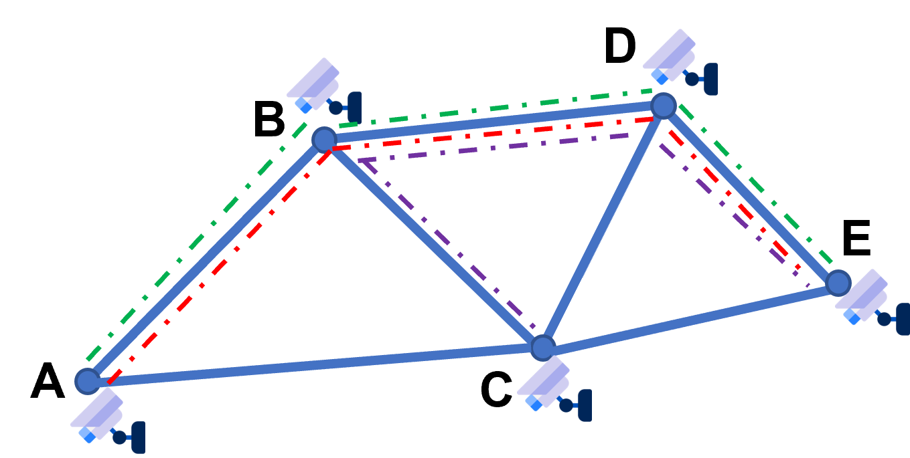

<style>
  .center-image {
    display: block;
    margin: 0 auto;
    text-align: center;
  }
</style>

<h2 align="center">Co-movement Pattern Mining from Videos</h2>

<div class="center-image">
  
</div>

This project provides the source code and datasets for our paper  "Co-movement Pattern Mining from Videos." The discovery of co-movement patterns involves identifying all groups of objects that move within spatial proximity for a specified time interval.
In the paper mentioned above, we expand the meanings of co-movement patterns by migrating the data source from GPS sensors to surveillance cameras and conduct the first investigation into mining co-movement patterns from videos.

## Structure
The core of this project revolves around the TCS-tree and its related optimization code. Additionally, it includes the two baseline algorithms and the datasets mentioned in the paper. The primary structure of this project can be summarized as follows:

* <span style="font-weight:bold;">Co-movement-Pattern-Mining-from-Videos</span>
  * <span style="color: #0033CC;">SequenceAheadMining</span> (TCS-tree and related code) 
  * CMCBaseline (CMC algorithm)
  * AprioriBaseline (Apriori based enumerator)
  * Datasets

> Note that SequenceAheadMining, CMCBaseline, and AprioriBaseline are three separate subprojects that are compiled and run independently.


## Requirements
- **Operating System:** Linux
- **C++ Standard Requirement:** requires a minimum of C++14 for compatibility with features like constexpr and variadic templates. 
- **Compiler Requirements:** GCC 11.4 or later (for support of GCC-specific extensions)
- **Build Tools Requirement:**
  - **CMake:** Version 3.22 or later is required for configuring the build process.
  - **Make:** A compatible version 4.3 of the 'make' tool is required to build the project.

## Installation
> Before starting, please ensure that you have installed and met all the requirements mentioned in the previous section.

You can quickly compile and install any of the subprojects in this project by following these steps (using "SequenceAheadMining" as an example):
1. **Clone the repository to your local machine:**
```shell
git clone https://github.com/Mateng0228/Co-movement-Pattern-Mining-from-Videos.git
```
2. **Change to the directory of subproject you want to use:**
```shell
cd Co-movement-Pattern-Mining-from-Videos/SequenceAheadMining
```
3. **Create a 'build' directory and change to it:**
```shell
mkdir build
cd build
```
4. **Compile current project using CMake and Make:**
```shell
cmake ..
make
```
5. **Ensure the "datasets" folder in subproject contains the dataset you want to use:**
```shell
cd ../../Datasets/
unzip "dataset-name.zip" # if necessary
cp -r "dataset-name" ../SequenceAheadMining/datasets/
cd ../SequenceAheadMining/
```
Now you can find and run the final executable file in the corresponding "build" directory according to the instructions in our "Usage" section later on.

## Usage
The three subprojects in this project have a similar command-line parameter interface. You can correctly configure and run the programs in the following format:
```shell
"Executable-File" "dataset-name" "m" "k" "epsilon" [OPTIONS]
```
- Note that you must switch to the root directory of the current subproject before running the executable file (due to relative path addressing in the code). If the executable file is located in the corresponding "build" directory, it means you should run the program using the format of "build/file-name".
- Again, please ensure that the "datasets" directory of the current subproject contains the "dataset-name" directory corresponding to your dataset.
- The meanings of the parameters "m," "k," and "eps" are consistent with those in the paper.
- The two baseline algorithms do not have any additional [OPTIONS] parameters. However, for our TCS algorithm, the additional [OPTIONS] parameters are as follows:
  - **no-tcs**: remove all optimizations related to the TCS-tree
  - **cmc**: substitute the sliding-window-based verification with CMC-like algorithm
  - **no-hash**: substitute the hashing-based dominance eliminator with one regular deduplication method
  - **details**: additionally output detailed pattern results to "results/output.csv"

After the program runs successfully, it will output the total execution time of the algorithm and the number of pattern results found.  
By configuring the parameters of the TCS algorithm and baseline algorithms appropriately, along with using the provided datasets, readers should be able to reproduce the experimental results in the paper.

## Examples
Here are some specific usage examples (still using SequenceAheadMining for demonstration):

**1. Run the TCS algorithm on the "singapore" dataset, evaluate the detailed execution time, and write the results to "result/output.csv".**
- **Input**:
```shell
build/Project singapore 3 5 60 details
```
- **Output**:
```shell
parameters{dataset:singapore, m:3, k:5, epsilon:60}, additional options[ details ]:
cluster: 2.22219 | build tree: 0.246959 | verification: 0.25313 | de_duplicate: 0.076563 | Total elapsed time: 4.09293s
```

**2. Run the TCS algorithm on the "chengdu" dataset without using the sliding-window-based verification.**
- **Input**:
```shell
build/Project chengdu 3 5 60 no-hash
```
- **Output**:
```shell
parameters{dataset:chengdu, m:3, k:5, epsilon:60}, additional options[ no-hash ]:
cluster: 1.2286 | build tree: 1.2824 | verification: 1.67254 | de_duplicate: 7.36348 | Total number of discovered convoys: 4327, object combinations: 4076 - Total elapsed time: 13.4096s
```

## Contact
If you encounter any problems, please contact the code maintainer at [mt0228@zju.edu.cn](mailto:mt0228@zju.edu.cn). Please note that simply raising "Issues" in github may not always be the most effective way to get our attention.
