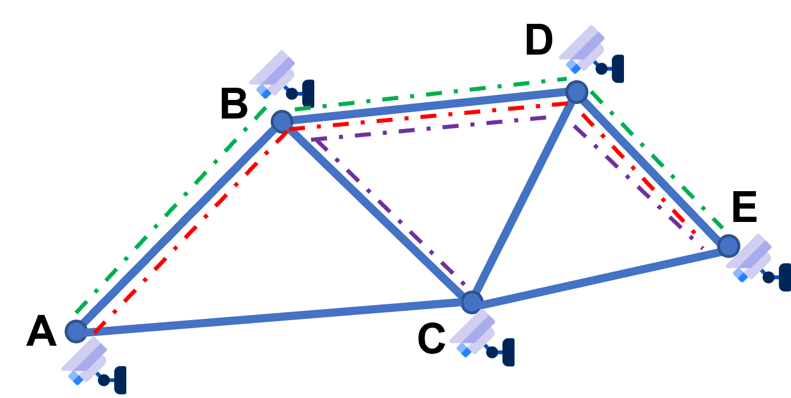

<h2 align="center">Co-movement Pattern Mining from Videos</h2>

<p align="center">
  
</p>

This project provides the source code and datasets for our paper  "Co-movement Pattern Mining from Videos" and "Efficient discovery of co-movement patterns from video data". The discovery of co-movement patterns involves identifying all groups of objects that move within spatial proximity for a specified time interval.
In the paper mentioned above, we expand the meanings of co-movement patterns by migrating the data source from GPS sensors to surveillance cameras and conduct the first investigation into mining co-movement patterns from videos.

## Structure
This repository provides the implementation of TCS-tree and the streaming algorithm CP-tree proposed in our paper. The repository is organized as follows:

```shell
Co-movement-Pattern-Mining-from-Videos
   |——————TCS-tree # (offline) TCS-tree implementation and optimizations
   |         └——————algorithm
   |         └——————datasets
   |         └——————results
   |         └——————*.h
   |         └——————main.cpp
   |——————CP-tree # (streaming) CP-tree implementation
   |         └——————*.h
   |         └——————main.cpp
   └——————Datasets
             └——————singapore
             └——————chengdu
             └——————Carla
```

> Note that TCS-tree and CP-tree are separate subprojects that are compiled and run independently.


## Requirements
- **Operating System:** Linux
- **C++ Standard Requirement:** requires a minimum of C++14 for compatibility with features like constexpr and variadic templates. 
- **Compiler Requirements:** GCC 11.4 or later (for support of GCC-specific extensions)
- **Build Tools Requirement:**
  - **CMake:** Version 3.22 or later is required for configuring the build process.
  - **Make:** A compatible version 4.3 of the 'make' tool is required to build the project.

## Installation
> Before starting, please ensure that you have installed and met all the requirements mentioned in the previous section.

You can quickly compile and install any of the subprojects in this project by following these steps (using "TCS-tree" as an example):
1. **Clone the repository to your local machine:**
```shell
git clone https://github.com/Mateng0228/Co-movement-Pattern-Mining-from-Videos.git
```
2. **Change to the directory of subproject you want to use:**
```shell
cd Co-movement-Pattern-Mining-from-Videos/TCS-tree
```
3. **Create a 'build' directory and change to it:**
```shell
mkdir build
cd build
```
4. **Compile current project using CMake and Make:**
```shell
cmake ..
make
```
5. **Ensure the "datasets" folder in subproject contains the dataset you want to use:**
```shell
cd ../../Datasets/
unzip "dataset-name.zip" # if necessary
cp -r "dataset-name" ../TCS-tree/datasets/
cd ../TCS-tree/
```
Now you can find and run the final executable file in the corresponding "build" directory according to the instructions in our "Usage and Reproduction" section later on.

## Usage and Reproduction
The TCS-tree implementation in this repository provides a command-line interface. You can run the program with the following format:
```shell
Executable-File <dataset-name> <m> <k> <epsilon> [OPTIONS]
```
- Note that you must switch to the root directory of the current subproject before running the executable file (due to relative path addressing in the code). If the executable file is located in the corresponding "build" directory, it means you should run the program using the format of "build/file-name".
- Again, please ensure that the "datasets" directory of the current subproject contains the "dataset-name" directory corresponding to your dataset.
- The meanings of the parameters "m," "k," and "eps" are consistent with those in the paper.
- The additional [OPTIONS] parameters are as follows:
  - **no-tcs**: remove all optimizations related to the TCS-tree
  - **cmc**: substitute the sliding-window-based verification with CMC-like algorithm
  - **no-hash**: substitute the hashing-based dominance eliminator with one regular deduplication method
  - **details**: additionally output detailed pattern results to "results/output.csv"

The CP-tree implementation uses a similar command-line interface to TCS-tree:
```shell
Executable-File <dataset-name> <m> <k> <epsilon> <size>
```
where size specifies the number of records to process. The meanings of the other parameters are the same as in TCS-tree and are omitted here for brevity.

### Additional Notes on Reproduction
The structure of "singapore" and "chengdu" datasets is straightforward. In their uncompressed directories, each text file represents the travel path of an individual vehicle. Regarding the "Carla" dataset, we have included supplementary information about its organization and usage in the readme.txt file within the dataset folder.  
Additionally, for precise parameter settings and comparative methods employed in the experiments presented in our paper, please consult the "Experiments" section of our original paper.  

## Examples
**Here are some specific usage examples (still using TCS-tree for demonstration):**

1. Run the TCS algorithm on the "singapore" dataset, evaluate the detailed execution time, and write the results to "result/output.csv".
- **Input**:
```shell
build/Project singapore 3 5 60 details
```
- **Output**:
```shell
parameters{dataset:singapore, m:3, k:5, epsilon:60}, additional options[ details ]:
cluster: 2.22219 | build tree: 0.246959 | verification: 0.25313 | de_duplicate: 0.076563 | Total elapsed time: 4.09293s
```

2. Run the TCS algorithm on the "chengdu" dataset without using the sliding-window-based verification.
- **Input**:
```shell
build/Project chengdu 3 5 60 cmc
```
- **Output**:
```shell
parameters{dataset:chengdu, m:3, k:5, epsilon:60}, additional options[ cmc ]:
cluster: 1.23426 | build tree: 1.26664 | verification: 8.81589 | de_duplicate: 0.458421 | Total number of discovered convoys: 4327, object combinations: 4076 - Total elapsed time: 13.8591s
```

## Contact
If you encounter any problems, please contact the code maintainer at [mt0228@zju.edu.cn](mailto:mt0228@zju.edu.cn). Please note that simply raising "Issues" in github may not always be the most effective way to get our attention.
